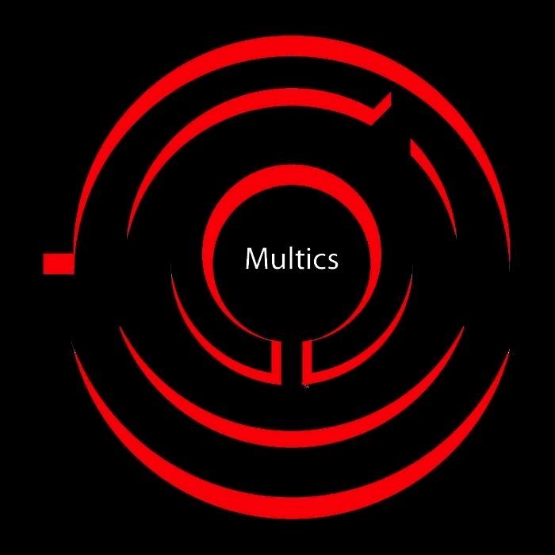

# Introduktion

## Hvad vi skal gennem
- 60'erne: Multics\pause
- 70'erne: Unix\pause
- 80'erne: Patenterne, GNU\pause
- 90'erne: Linux\pause
- I dag: Stats\pause
- Aktører

# Ophav

## Multics
{ width=20% }\pause

- 1963-1969 
	- Bell Labs
	- General Electronics\pause
- Programmører
	- Ken Thompson
	- Dennis Ritchie\pause
- Bell Labs trækker sig ud af projektet i 1969
- Space Travel

## Unix
{ width=20% }\pause

- 1970-1990\pause
- Unix udviklede sig til et komplet system - bedre end Multics\pause
- Licens der gav lov til at studerende kunne arbejde på koden\pause
- AT\&T krævede dog betaling for at bruge og distribuere Unix

## Berkely Software Distribution
{ width=20% }\pause

- 1978 begyndte man at distribuere BSD, som var opbygget omkring Unix\pause
- Primærer aktør var Bill Joy\pause
- Brugerne var trætte af begrænsninger af licens, så man begyndte at skrive sin egen kode for at frigøre sig fra AT\&T\pause
- 51.540,08kr/årligt (2022-penge) for at bruge licenserne\pause
- AT\&T blev sure og sagsøgte i 1992\pause
- AT\&T solgte i 1995 rettigheder af Unix til The Santa Cruz Operation, Inc., som sagsøgte alt of alle\pause
- Unix og BSD var pludselig ikke særlig interessant for virksomheder pga usikkerhed og retsager

## Linux
{ width=20% }\pause

- 1991: Første version\pause
- Linus Torvalds\pause
- 1992: Første offcielle release\pause
- Alt bygger på viden fra Unix, hvor Linux har store ligheder og samme mentalitet\pause
- Linux er _ikke_ Unix, men Unix-like for at undgå licenser\pause
- Linux skulle ikke være open source, men Richard Stallman overbeviser Linus til at bruge hans GNU General Public License (GPL)

## Linux udvikling
{ width=20% }\pause

- 2 commits i timen i 2005, og 10,7 commits i timen i 2019\pause
- 4300 udviklere\pause
- 530 virksomheder: Intel, Red Hat, IBM, SUSE, Linaro, Google, Samsung, AMD, Renesas, Texas Instruments, and Oracle.

## Hvad er status i dag - Supercomputere
{ width=50% }

## Hvad er status i dag - PC
{ width=90% }

# Flowchart

## Timeline
| { width=90% } |
| :--: |

# Aktører

## Multics/Unix/Linux
- Ken Thompson
	- Multics, Unix, B, regex, grep, Space Travel, UTF-8, Go-lang\pause
- Dennis Ritchie
	- Multics, Unix, C\pause
- Bill Joy
	- ex, vi, TCP/IP, BSD\pause
- Linus Torvalds
	- Linux, Git\pause
- Lennart Poettering
	- systemd, PulseAudio

# Afslutning

## Spørgsmål

Spørg for satan!

## Sidste slide

5 minutters pause
