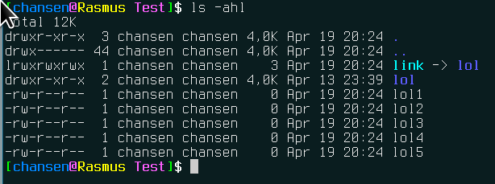
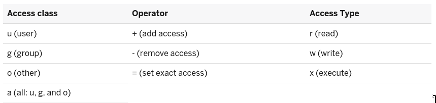
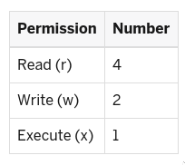
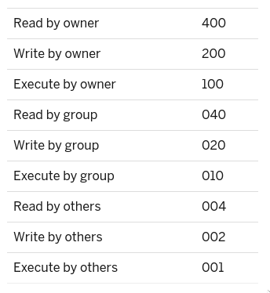
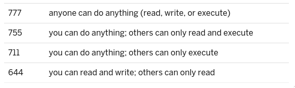

# Introduktion

## Hvad vi skal gennem
- SSH
- Manipulere filer
- Bruge sudo
- Rettigheder over filer og mapper

# ssh

## ssh 1
- Startet af Tatu Ylonen\pause
- Theo de Raadt et al. fixede bugs og gjorde det sikkert\pause
- Brugt overalt på Unix og unix-like systemer\pause
- alt er krypteret

| Afsender		| ssh 	| Modtager	   |
| --- | ---| ---| 
| Pakke + nøgle 1	| ->	|  Pakke nøgle 1   |
| Pakke - nøgle 1	| <- 	|  Pakke + nøgle 2 |
| Pakke nøgle 2		| ->	|  Pakke - nøgle 2 |

## ssh 2
- For at logge ind i en maskine skal du bruge et brugernavn og ip eller hostnavn:

    ssh bruger@192.166.1.15

- Bemærk at nogen OS har root slået til og at man kan logge ind gennem `ssh` med root. Dette er ikke en god ide\pause

- hvorfor ikke?\pause

- Der findes mange tricks til `ssh` men lige pt bruger vi det kun til at logge ind i vores server

# Manipulering

## Manualer
- Hvis du mangler noget til din kommando, så kan der være meget at finde ved at bruge man-funktionen

    man ls\pause

- Hvorfor er det nice at man ikke behøver google?\pause
- Man kan komme utroligt langt _kun_ ved at bruge `man`

## Touch
- `touch`\pause
- Touch bruges til at oprette en tom fil\pause

    man touch

- Lav et par filer med touch\pause
- Lav 100 filer med touch

## mkdir
- `mkdir`\pause
- mkdir bruges til at lave et directory

    man mkdir

- Lav en mappe\pause
- Lav en mappe inden i en anden mappe

## mv
- `mv`\pause
- mv bruges til at flytte filer. Det svarer til at cut/klippe i Windows\pause

    man mv

- Lav tre mapper og flyt dem ind i hinanden\pause

## cp
- `cp`\pause
- cp bruges til at kopiere filer. Det svarer til kopiér/copy i Windows\pause

    man cp

- Kopier en fil fra et dir til et andet\pause
- Kopier en mappe ind i en anden

## Slette
- rm
- rm bruges til at slette filer eller slette directories med indhold\pause

    man rm

- slet en fil\pause
- slet 3 filer\pause
- slet 1 directory

# Konfigurationer

## Editors
Mange af konfigurationer er flade tekst-filer, hvilket gør at vi er nødt til at kende til noget basal tekstbehandling i terminalen. Der findes rigtig mange forskellige typer af `text editors`, hvor vi vil lære at bruge to af dem.

- Nano
- Vi

## Nano

    nano

- man nano

## vi

    vi

- man vi\pause
- Hvem lavede vi?\pause
- Hvis du har `vim` installeret, så prøv `vimtutor`

# sudo

## Oprettelse af bruger
- `useradd`

    man useradd

- lav en ny bruger\pause
- skift password på bruger med `passwd`\pause
- skift til bruger med `su`\pause
- Log ud af bruger med `exit`

## Hvornår?
- Sudo (Super User Do) bruges til at lave ændringer på systemniveau\pause
- Kan også bruges til at lave ændringer, hvor man ellers ikke har rettigheder til det\pause
- Hvor kunne det være?\pause

## Hvad kræver sudo?
- root har generelt adgang til alt\pause
- man kan give brugere privilegier\pause
- gruppen hedder wheel\pause
- Tilføj en gruppe til wheel med

    usermod -aG wheel \$USER

# Rettigheder

## Filer 1.0

{ width=100% }

## ugo 1.1

{ width=100% }

## ugo 1.2
- chmod bruges til at ændre rettigheder på filer\pause
- man chmod\pause
- Lav en fil og giv alle rettigheder\pause

    chmod a+rwx filnavn.ext

## ugo 1.3
- Lav en fil og giv kun jeres bruger lov til at læse og afvikle\pause

    touch filnavn.ext && chmod u+rx filnavn.ext

## octal 1.0

{ width=60% }

## octal 1.1

{ width=50% }

## octal 1.2

{ width=100% }

# Afslutning

## Spørgsmål

Spørg for satan!

## Sidste slide

Vi ses i morgen!
