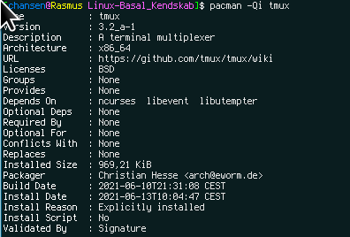

# Introduktion

## Hvad vi skal gennem
- Lidt nomenklatur
- Linux-kernen
- Filsystemer
- Directories
- Opbygningen af en distro
- Package-managers
- Repositories

# Nomenklatur

## Nomenklatur
- Linux er _kun_ kernen - intet andet\pause
- Distro er en samling af applikationer, som udgør et komplet OS\pause
- Linux er unix-like, men Unix er ikke Linux og Linux er ikke Unix\pause
- Linus er ikke Linux og Linux er ikke Linus

# Kernen

## Kernen

{ width=80% }

# Filsystem

## fstab

{ width=105% }

    cat /etc/fstab

## lsblk

{ width=105% }

## df

{ width=105% }

# Directories

## root

{ width=80% }

## dir: /
- / 

root. Det her er det laveste niveau af filsystemet. Alt på Linux tager udgangspunkt i dette directory

## dir: bin
- /bin/
- /sbin/
- /usr/bin/
- /usr/local/bin/

The place to be, if you're a binary. Bin-directory er der, hvor alle programmer bliver installeret fra repositories. Hvis man selv laver nogle programmer kan man med fordel ligge dem i /usr/local/bin/, hvorefter alle på maskinen kan afvikle dem

Obs på hvad der er i din path - de kan skifte eller måske skal de ændres?

    echo \$PATH

## dir: dev
- /dev/

Devices ligger her. Det kunne være webcam, harddisk, raid, USB, CPU, netkort osv. random hører også til her og genererer en masse volapyk\pause

    cat /dev/random

Hvad kan det mon bruges til?

## dir: etc
- /etc/

Her ligger alle konfigurationsfiler som er system-wide. Der er eks her at vi finder ssh, incron.conf, ntpd.conf, vimrc, sudo.conf

- /home/\$USER/.config/

Her ligger alle brugerens konfigurationsfiler. Hvis nogen filer ligger her påvirker de kun den enkelte bruger der er logget ind. Her kan man eks ændre sin brugers vim-indstillinger

## dir: home
- /home/

Her hører alle brugerne til, hvis de har fået et home-dir. Man kan oprette brugere, som lever uden for /home/ og man kan også oprette brugere, som slet ikke har et home-dir

## dir: mnt
- /mnt/

Mount er generelt stedet man mounter nye lokationer. Dette kan være et netværksdrev, cdrom, usb-stik

## dir: root
- /root/

Dette er roots home-dir

## dir: tmp
- /tmp/

temporary. Stedet hvor systemet lægger filer for eks åbne programmer eller filer som der bliver arbejdet med. Disse filer bliver slettet når der genstartes.

## root

{ width=80% }

# Distro

## CentOS
- Kernen: Dette er forbindelsen mellem hardware og software\pause
- coreutils: En samling af programmer, som sørger for basal funktionalitet\pause
- Package-manager: En applikation der installere/afinstallerer programmer og holder dem opdateret\pause
- sysinit (systemd): Vores måde at håndtere services

# Repositories

## What the hell is it!?
- Vil du google efter vlc?\pause
- Vil du google efter spotify?\pause
- Kan man komme til at downloade en forkert pakke?!\pause
- Repository er din distros sted hvor den henter software\pause
- Størrelse på repo afhænger af antallet af brugere/maintainers\pause
- Nogle distroer er gigantiske andre er små
	- Debian = relativt gigantisk
	- CentOS = møj møj lille\pause
- Hver maintainer har sin egne applikationer\pause
- Hvert enkelt stykke software er testet\pause
- Nogen holder konstant øje med det

## Maintainer 

{ width=85% }

# Package-managers

## Pacman - Update

{ width=85% }

## Pacman - Install

{ width=100% }

## apt, dnf, yum eller pacman?
- Der findes mange slags, men de gør praktisk talt det samme
- Når man lærer en distro at kende er det altid ens
- Der er forskellige årsager til, at man har valgt at bygge forskellige\pause
- Automatisering
	- Kan man automatisere denne proces?
	- Pro/cons?	

# Afslutning

## Spørgsmål

{ width=70% }

## Sidste slide

5 minutters pause
