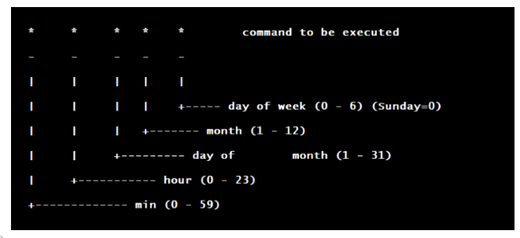

# Introduktion

## Hvad vi skal gennem
- Forstå services
- Lav din egen service
- Start/stop service
- Prøv crond

# Services

## systemd-services
- Services er meget lig crond, men kan nogle ekstra ting
- Check services

    systemctl list-unit-files

- Find status på en service

    systemctl status sshd.service

- Genstart en service 

    systemctl restart sshd.service

## Opgave
- Lav script
- Lav service der startet script
- Reload services
- Start script
- Check status
- Stop script

## Script
- Lav dit script

    nano dit-navn-her.sh

```
#!/bin/bash

TIME=$(date)

echo $TIME >> /root/dit-navn-her
```

- Læg scriptet i /usr/local/bin/
- Gør det eksikverbart

## Lav service-fil

```
[Unit]
Description=example systemd service unit file.

[Service]
ExecStart=/bin/bash /usr/local/bin/example.sh

[Install]
WantedBy=multi-user.target
```

- Læg det i /etc/systemd/system/

## Systemd-management
- Reload services

    systemctl daemon-reload

- Start service

    systemctl start dit-navn-her.service

- Check status

    systemctl status dit-navn-her.service

## crond
- Samme opgave kan afvikles i crond
- Åben crontab

    crontab -e

- Tilføj script til afvikling

    \* * * * * /bin/bash /usr/local/bin/dit-navn-her.sh

## Crond-time

{ width=100% }

[https://crontab.guru/](https://crontab.guru/)


# Afslutning

## Spørgsmål

{ width=70% }

## Sidste slide

Vi ses i morgen!
