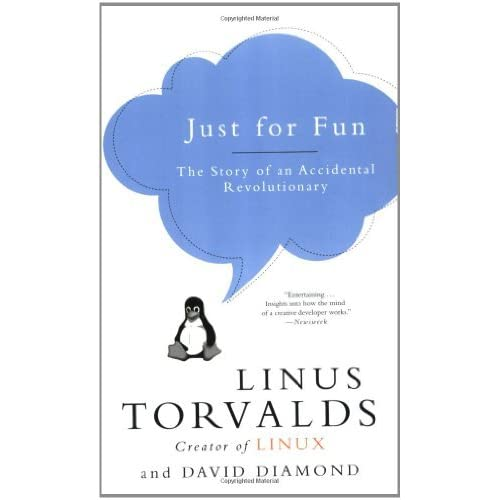

# Introduktion

## Hvad vi skal gennem
- Lidt om SELinux
- Super tanker
	- Hvordan bliver man god til Linux?
	- Hvad kan man læse?

# SELinux

## Hvad er det?
- Nogen udviklede det
- NSA overtog det
- NSA gav det videre til RedHat

## Hvad kan det?
- Lukke ned for brugere
- Lukke ned for adgang
- Lukke ned for programmer
- Alt foregår i kontekster

# Super tanker

## How do aye gid gud add linoks?
- Brug tid på Linux\pause
- Lav en liste over ting du gerne ville kunne\pause
- Lav en liste over, hvad du ikke kan leve uden\pause
- Optimér dit workflow\pause
- Minimalisér\pause
- Lær at bruge vi

## Bog
- Hvis man skal læse en bog

{ width=50% }

# Afslutning

## Spørgsmål

{ width=70% }

## Sidste slide

Tak fordi I kom!
